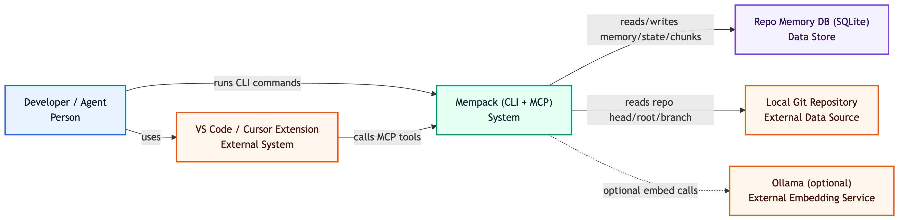
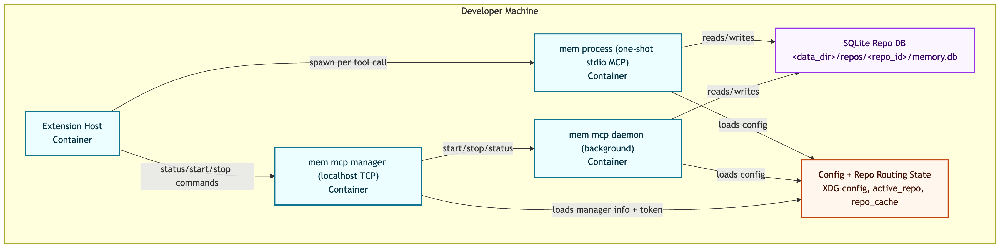
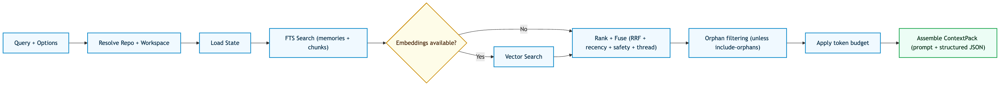
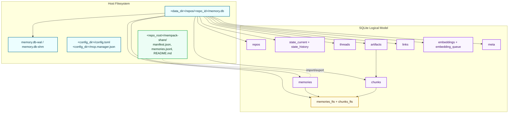

# Mempack Architecture

This document describes Mempack runtime architecture, boundaries, and invariants.

Purpose:
- Show system shape and boundaries quickly.
- Make design changes reviewable with consistent diagrams.
- Keep contracts explicit (repo scoping, MCP behavior, storage invariants).

Out of scope:
- Full API flag reference documentation.
- Full schema-level reference text inline in this file (see `docs/storage.md`).

The implementation is authoritative. Keep this document updated in the same PR as architecture changes.

## 1) Context

Mempack is a local-first, repo-scoped memory system for coding workflows.

Primary surfaces:
- CLI (`mem ...`)
- MCP tools/server (`mem mcp ...`, `mempack_*`)
- VS Code/Cursor extension (`extensions/vscode-mempack`)

Per-repo persistent data location:
- `<data_dir>/repos/<repo_id>/memory.db`

## 2) Diagram Conventions

- One abstraction level per diagram.
- Every diagram includes audience + scope.
- Relationship arrows are labeled with actions.
- Mermaid sources are version-controlled under `docs/diagrams/src/`.
- Rendered diagram assets live under `docs/diagrams/`.

Legend:
- `Person` actor/user
- `System` high-level software system
- `Container` runtime process/service/datastore
- `Component` internal module/function cluster

## 3) L1: System Context

Audience: product engineers and integrators.
Scope: Mempack as a system and its external dependencies.

Source: `docs/diagrams/src/l1-system-context.mmd`

## 4) L2: Container View

Audience: maintainers changing runtime/deployment behavior.
Scope: runtime processes, control plane, and persistence boundaries.

Source: `docs/diagrams/src/l2-container-view.mmd`

Operational note:
- One-shot stdio uses no network port.
- `mem mcp manager` is the only MCP path that listens on `127.0.0.1:<port>`.

## 5) L3: Retrieval Components

Audience: maintainers changing `get` / `explain` / `mempack_get_context`.
Scope: retrieval orchestration in `internal/app` and store/embed integrations.

  

Source: `docs/diagrams/src/l3-retrieval-components.mmd`

Primary files:
- `internal/app/context_builder.go`
- `internal/app/explain_builder.go`
- `internal/app/rank.go`
- `internal/app/budget.go`
- `internal/app/vector_search.go`

## 5a) L3.5: Storage Bird's-Eye

Audience: maintainers changing persistence, ingest, or share behavior.
Scope: data root layout, SQLite logical model, and artifact paths.

Source: `docs/diagrams/src/l3-storage-birds-eye.mmd`

Detailed table/column and artifact reference: `docs/storage.md`

## 6) Runtime Modes and Network Behavior

| Mode | Command path | Network port | Typical caller |
|---|---|---|---|
| One-shot stdio | `mem mcp ...` per request | None | Extension tool call |
| Daemon | `mem mcp start/status/stop` | None (local process only) | Local CLI/user |
| Manager control plane | `mem mcp manager` + `manager status` | `127.0.0.1:<port>` | CLI + extension status/control |

## 7) Code Map

- `cmd/mem/main.go`: process entrypoint.
- `internal/app/`: command dispatch, handlers, orchestration.
- `internal/store/`: schema, migrations, records API, FTS, links/state.
- `internal/config/`: config loading and data-root/repo routing.
- `internal/repo/`, `internal/reporesolve/`, `internal/pathutil/`: repo detection and canonical IDs.
- `internal/embed/`: embedding provider abstraction and calls.
- `extensions/vscode-mempack/src/`: extension UI and MCP/CLI client behavior.

## 8) Invariants

- Repo/workspace scoping is mandatory for all read/write operations.
- State is authoritative; memories/chunks are supporting evidence.
- MCP structured-content contract remains backward-compatible.
- Data-root precedence remains deterministic:
  1. `--data-dir`
  2. `MEMPACK_DATA_DIR`
  3. `data_dir` in config
- Extension status is observational and should align with CLI/daemon truth.

## 9) Boundaries

- `internal/app` owns orchestration/policy; avoid SQL logic leakage here.
- `internal/store` owns persistence and migrations; callers use store APIs.
- Extension should not invent independent MCP lifecycle truth.
- `--require-repo` / `mcp_require_repo=true` disables fallback behavior and fails fast.

Repo resolution order (no explicit override):
1. strict git detection from cwd
2. non-strict cwd fallback (path-scoped identity)
3. `active_repo` fallback (disabled by require-repo)

With explicit `--repo` / MCP `repo`, override is used first.

## 10) Cross-Cutting Concerns

- Safety: write-mode gating, secret/injection checks, explicit context rules.
- Performance: FTS-first retrieval, optional vectors, token budget cap, repo-cache shortcuts.
- Operability: doctor/repair flows, manager PID/port visibility.

## 11) Change Checklist

When architecture changes:
1. Update this file in the same PR.
2. Add or adjust targeted tests.
3. Run:
   - `go test ./...`
   - `npm run compile` in `extensions/vscode-mempack`
