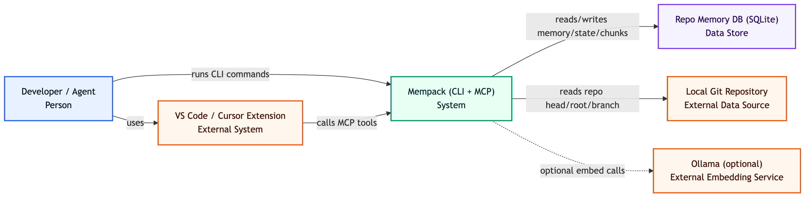

# Mem: Repo-Scoped Memory for Coding Agents

Mem is a local-first memory system for coding workflows.

It stores three things per repo:
- State: current project context.
- Memories: short durable decisions.
- Evidence: indexed code/document chunks.

Data is persisted in local SQLite under your configured `data_dir`.

## Documentation Map

Task-first:
- First-time setup + troubleshooting: `docs/onboarding.md`
- Common workflows and copy-pasteable examples: `docs/cookbook.md`
- Automation, CI, and shell integration: `docs/scripting.md`

Reference:
- Full CLI syntax reference: `docs/cli.md`
- Homebrew install and tap maintenance: `docs/homebrew.md`
- Terminal UI guidance for CLI output: `docs/terminal-ui.md`
- Storage layout, schema, and artifacts: `docs/storage.md`
- Architecture + runtime diagrams: `ARCHITECTURE.md`
- Sandbox evaluation/testing process: `docs/memory-testing-process.md`
- VS Code/Cursor extension: `extensions/vscode-mem/README.md`

## Quick Start

1. Install CLI:

Homebrew (macOS):

```bash
brew tap suju297/mem
brew install suju297/mem/mem-cli
```

The Homebrew formula is named `mem-cli`; the installed binary is still `mem`.

GitHub Releases installer (macOS/Linux):

```bash
curl -fsSL https://raw.githubusercontent.com/suju297/mem/main/scripts/install.sh | sh -s -- --repo suju297/mem
```

Add PATH automatically during install (macOS/Linux):

```bash
curl -fsSL https://raw.githubusercontent.com/suju297/mem/main/scripts/install.sh | sh -s -- --repo suju297/mem --add-to-path
```

Windows (PowerShell):

```powershell
iwr https://raw.githubusercontent.com/suju297/mem/main/scripts/install.ps1 -OutFile $env:TEMP\\mem-install.ps1; & $env:TEMP\\mem-install.ps1 -Repo suju297/mem
```

Windows PATH behavior:
- By default, installer updates user PATH (`-AddToPath $true`).
- To skip PATH update: `-AddToPath $false`.

If release assets are unavailable, installers fall back to source build (Go toolchain required).

Verify:

```bash
mem --version
```

2. Initialize in your repo:

```bash
mem init
```

3. Save and retrieve one memory:

```bash
mem add --thread T-setup --title "Mem ready" --summary "Initialized memory for this repo"
mem get "Mem ready" --format prompt
```

4. Connect Codex MCP:

```bash
codex mcp add mem -- mem mcp --require-repo
codex mcp list
```

5. MCP runtime modes:

- `mem mcp` runs the stdio server for a directly attached MCP client.
- With `--require-repo`, stdio startup is handshake-safe even if the host launches outside a repo; tool calls must still pass `repo=<workspace root>` in that case.
- `mem mcp start|status|stop` manage the local background daemon.
- `mem mcp manager` remains a separate control-plane process.

6. Daemon lifecycle commands:

```bash
mem mcp start
mem mcp status
mem mcp stop
```

Next docs by task:
- First run and troubleshooting: `docs/onboarding.md`
- Common workflows: `docs/cookbook.md`
- Automation and CI: `docs/scripting.md`
- Exact syntax and flags: `docs/cli.md`

## Repo Scoping

Repo scoping options:
- Pass `repo=<workspaceRoot>` on every MCP tool call.
- Start MCP with `--repo /path/to/repo`.
- Enable strict mode with `--require-repo` (or `mcp_require_repo = true`).

Resolution order is:
1. Explicit repo argument (`--repo` / MCP `repo`)
2. Git root from current working directory
3. `active_repo` fallback (disabled in require-repo mode)

## CLI Reference

Basic form:

```text
mem [--data-dir <path>] <command> [options]
mem <command> --help
mem --version
```

Command groups:

| Group | Commands |
|---|---|
| Setup | `init`, `doctor`, `repos`, `use`, `version` |
| Retrieval | `get`, `explain`, `show`, `threads`, `thread`, `recent`, `sessions` |
| Writes | `add`, `update`, `supersede`, `link`, `checkpoint`, `forget` |
| Ingest/Embed | `ingest`, `ingest-artifact`, `embed` |
| Session/Share | `session upsert`, `share export`, `share import` |
| MCP | `mcp`, `mcp start|stop|status`, `mcp manager`, `mcp manager status` |
| Templates | `template` |

Common options:
- `--data-dir <path>`: override data root.
- `--repo <id|path>`: explicit repo scope.
- `--workspace <name>`: workspace scope.
- `--format json`: machine-readable output where supported.

Examples:

```bash
mem get "auth middleware" --format json
mem add --title "Auth plan" --summary "Use middleware"
mem mcp status
```

Full command syntax: `docs/cli.md`
Common workflows: `docs/cookbook.md`
Automation behavior: `docs/scripting.md`

## MCP Tool Surface

Primary tools:
- `mem_get_initial_context`
- `mem_get_context`
- `mem_explain`
- `mem_add_memory`
- `mem_update_memory`
- `mem_link_memories`
- `mem_checkpoint`

Write mode behavior:
- `ask`: default when writes are enabled; requires explicit confirmation
- `auto`: writes without confirmation
- `off`: disables write tools

## Configuration

Global config path:
- `XDG_CONFIG_HOME/mem/config.toml` (default `~/.config/mem/config.toml`)

Repo override path:
- `.mem/config.json`

Data directory precedence:
1. `--data-dir <path>`
2. `MEM_DATA_DIR=<path>`
3. `data_dir` in `config.toml`

Minimal example:

```toml
default_workspace = "default"
default_thread = "T-SESSION"
mcp_allow_write = true
mcp_write_mode = "ask"
mcp_require_repo = true
embedding_provider = "auto"
embedding_model = "nomic-embed-text"
```

## Architecture

Use this README for a quick mental model, and `ARCHITECTURE.md` for implementation-level boundaries and contracts.

### At a Glance (L1)



This view shows external clients (CLI, MCP tools, extension) and the core local runtime/storage shape.

### Detailed Views

- L2 runtime and persistence boundaries: `docs/diagrams/architecture-l2-container-view.png`
- L3 retrieval pipeline components: `docs/diagrams/architecture-l3-retrieval-components.png`
- L3.5 storage topology: `docs/diagrams/architecture-l3-storage-birds-eye.png`
- Full narrative and invariants: `ARCHITECTURE.md`

## VS Code/Cursor Extension

Extension implementation and usage are documented in:
- `extensions/vscode-mem/README.md`

Extension control model:
- Extension status reflects CLI/daemon state.
- MCP lifecycle control uses CLI-backed commands.

## Development

Run tests:

```bash
go test ./...
```

Build CLI:

```bash
go build -o mem ./cmd/mem
```

Build extension:

```bash
cd extensions/vscode-mem
npm install
npm run compile
npx @vscode/vsce package
```

## License

Mem is licensed under MIT. See `LICENSE`.

## Release History

Release details are available in git tags and commit history.
