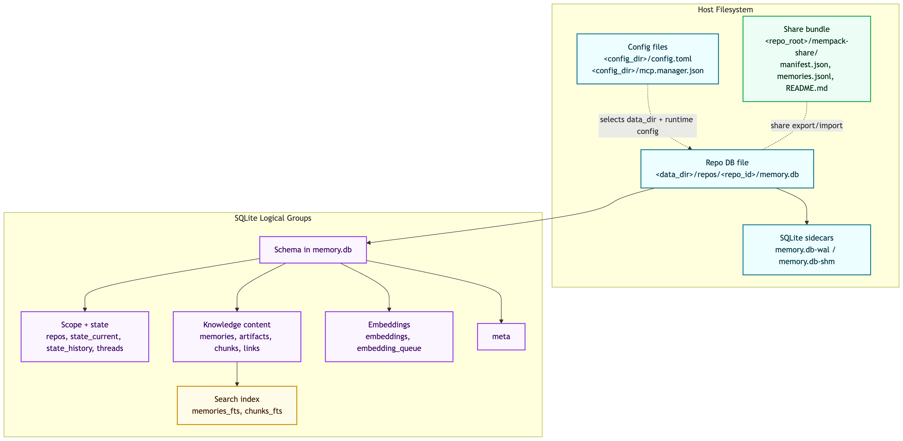

# Mem Storage and Schema

This document covers on-disk layout, SQLite tables/columns, and artifact flows.

Implementation source of truth:
- `internal/store/schema.sql`
- `internal/store/triggers.sql`
- `internal/store/migrate.go`
- `internal/app/ingest.go`
- `internal/app/share.go`

## Storage Topology Diagram

## Storage Layout

Data root resolution order:
1. `--data-dir`
2. `MEM_DATA_DIR`
3. `data_dir` in `config.toml`

Per-repo database:
- `<data_dir>/repos/<repo_id>/memory.db`
- SQLite sidecars: `memory.db-wal`, `memory.db-shm` (when WAL is active)

Config and manager state:
- `<config_dir>/config.toml`
- `<config_dir>/mcp.manager.json` (manager control-plane metadata: `port`, `token`, `pid`)

Share bundle files (repo-local):
- `<repo_root>/mem-share/manifest.json`
- `<repo_root>/mem-share/memories.jsonl`
- `<repo_root>/mem-share/README.md`

## SQLite Tables and Columns

Notes:
- All timestamps are stored as RFC3339 text.
- `workspace` defaults to `default` for scoped tables.
- Soft delete columns: `memories.deleted_at`, `chunks.deleted_at`.

### `repos`

| Column | Type | Notes |
|---|---|---|
| `repo_id` | `TEXT` | Primary key |
| `git_root` | `TEXT` | Canonical repo root path |
| `origin_hash` | `TEXT` | Hash of remote origin URL |
| `last_head` | `TEXT` | Last observed commit |
| `last_branch` | `TEXT` | Last observed branch |
| `created_at` | `TEXT` | First seen timestamp |
| `last_seen_at` | `TEXT` | Most recent seen timestamp |

### `state_current`

| Column | Type | Notes |
|---|---|---|
| `repo_id` | `TEXT` | Composite primary key |
| `workspace` | `TEXT` | Composite primary key |
| `state_json` | `TEXT` | Current authoritative state |
| `state_tokens` | `INTEGER` | Cached tokenizer count |
| `updated_at` | `TEXT` | Last update timestamp |

Primary key: (`repo_id`, `workspace`)

### `state_history`

| Column | Type | Notes |
|---|---|---|
| `state_id` | `TEXT` | Primary key |
| `repo_id` | `TEXT` | Repo scope |
| `workspace` | `TEXT` | Workspace scope |
| `state_json` | `TEXT` | Historical snapshot |
| `state_tokens` | `INTEGER` | Cached tokenizer count |
| `created_at` | `TEXT` | Snapshot time |
| `reason` | `TEXT` | Optional reason |

### `threads`

| Column | Type | Notes |
|---|---|---|
| `thread_id` | `TEXT` | Composite primary key |
| `repo_id` | `TEXT` | Composite primary key |
| `workspace` | `TEXT` | Composite primary key |
| `title` | `TEXT` | Thread title |
| `tags_json` | `TEXT` | JSON list of tags |
| `created_at` | `TEXT` | Creation time |

Primary key: (`thread_id`, `repo_id`, `workspace`)

### `memories`

| Column | Type | Notes |
|---|---|---|
| `id` | `TEXT` | Primary key |
| `repo_id` | `TEXT` | Repo scope |
| `workspace` | `TEXT` | Workspace scope |
| `thread_id` | `TEXT` | Optional thread link |
| `title` | `TEXT` | Required |
| `summary` | `TEXT` | Required |
| `summary_tokens` | `INTEGER` | Cached tokenizer count |
| `tags_json` | `TEXT` | JSON tags |
| `tags_text` | `TEXT` | Space-joined tags for FTS |
| `entities_json` | `TEXT` | JSON entities |
| `entities_text` | `TEXT` | Space-joined entities for FTS |
| `created_at` | `TEXT` | Creation time |
| `anchor_commit` | `TEXT` | Optional commit anchor |
| `superseded_by` | `TEXT` | Optional memory id |
| `deleted_at` | `TEXT` | Soft delete marker |

### `artifacts`

| Column | Type | Notes |
|---|---|---|
| `artifact_id` | `TEXT` | Primary key |
| `repo_id` | `TEXT` | Repo scope |
| `workspace` | `TEXT` | Workspace scope |
| `kind` | `TEXT` | Ingested source kind (for ingest: `file`) |
| `source` | `TEXT` | Relative source path |
| `content_hash` | `TEXT` | SHA256 of source bytes |
| `created_at` | `TEXT` | Creation time |

### `chunks`

| Column | Type | Notes |
|---|---|---|
| `chunk_id` | `TEXT` | Primary key |
| `repo_id` | `TEXT` | Repo scope |
| `workspace` | `TEXT` | Workspace scope |
| `artifact_id` | `TEXT` | Optional source artifact id |
| `thread_id` | `TEXT` | Optional thread link |
| `locator` | `TEXT` | Locator (`git:<sha>:<path>#Lx-Ly` or `file:<path>#Lx-Ly`) |
| `text` | `TEXT` | Chunk text |
| `text_hash` | `TEXT` | SHA256 of chunk text |
| `text_tokens` | `INTEGER` | Cached tokenizer count |
| `tags_json` | `TEXT` | JSON tags |
| `tags_text` | `TEXT` | Space-joined tags for FTS |
| `chunk_type` | `TEXT` | Chunk strategy marker (`line`, semantic variants) |
| `symbol_name` | `TEXT` | Optional symbol |
| `symbol_kind` | `TEXT` | Optional symbol kind |
| `created_at` | `TEXT` | Creation time |
| `deleted_at` | `TEXT` | Soft delete marker |

### `embeddings`

| Column | Type | Notes |
|---|---|---|
| `repo_id` | `TEXT` | Composite primary key |
| `workspace` | `TEXT` | Composite primary key |
| `kind` | `TEXT` | Composite primary key (`memory` or `chunk`) |
| `item_id` | `TEXT` | Composite primary key (memory/chunk id) |
| `model` | `TEXT` | Composite primary key |
| `content_hash` | `TEXT` | Hash of embedded source content |
| `vector_json` | `TEXT` | Serialized vector |
| `vector_dim` | `INTEGER` | Dimension |
| `created_at` | `TEXT` | Creation time |
| `updated_at` | `TEXT` | Last refresh time |

Primary key: (`repo_id`, `workspace`, `kind`, `item_id`, `model`)

### `embedding_queue`

| Column | Type | Notes |
|---|---|---|
| `queue_id` | `INTEGER` | Primary key, autoincrement |
| `repo_id` | `TEXT` | Queue scope |
| `workspace` | `TEXT` | Queue scope |
| `kind` | `TEXT` | `memory` or `chunk` |
| `item_id` | `TEXT` | Item id |
| `model` | `TEXT` | Embedding model |
| `created_at` | `TEXT` | Enqueued time |

Unique index: (`repo_id`, `workspace`, `kind`, `item_id`, `model`)

### `links`

| Column | Type | Notes |
|---|---|---|
| `from_id` | `TEXT` | Composite primary key |
| `rel` | `TEXT` | Composite primary key (relation type) |
| `to_id` | `TEXT` | Composite primary key |
| `weight` | `REAL` | Optional edge weight |
| `created_at` | `TEXT` | Link time |

Primary key: (`from_id`, `rel`, `to_id`)

### `meta`

| Column | Type | Notes |
|---|---|---|
| `key` | `TEXT` | Primary key |
| `value` | `TEXT` | Value payload |

### `memories_fts` (virtual FTS5)

| Column | Type | Notes |
|---|---|---|
| `title` | FTS | Indexed |
| `summary` | FTS | Indexed |
| `tags` | FTS | Indexed |
| `entities` | FTS | Indexed |
| `repo_id` | FTS | Unindexed scope column |
| `workspace` | FTS | Unindexed scope column |
| `mem_id` | FTS | Unindexed memory id |

Tokenizer: `porter unicode61`

### `chunks_fts` (virtual FTS5)

| Column | Type | Notes |
|---|---|---|
| `locator` | FTS | Indexed |
| `text` | FTS | Indexed |
| `tags` | FTS | Indexed |
| `repo_id` | FTS | Unindexed scope column |
| `workspace` | FTS | Unindexed scope column |
| `chunk_id` | FTS | Unindexed chunk id |
| `thread_id` | FTS | Unindexed thread id |

Tokenizer: `porter unicode61`

## Indexes and Triggers

Primary query indexes:
- `idx_memories_repo_created` on `memories(repo_id, workspace, created_at)`
- `idx_memories_thread` on `memories(repo_id, workspace, thread_id)`
- `idx_chunks_repo_created` on `chunks(repo_id, workspace, created_at)`
- `idx_chunks_thread` on `chunks(repo_id, workspace, thread_id)`
- `idx_chunks_symbol` on `chunks(repo_id, workspace, symbol_name)` with `symbol_name` filter
- `idx_embeddings_kind_model` on `embeddings(repo_id, workspace, kind, model)`
- `idx_embedding_queue_unique` unique on `embedding_queue(repo_id, workspace, kind, item_id, model)`
- `idx_links_from` on `links(from_id)`
- `idx_links_to` on `links(to_id)`
- `idx_chunks_unique` unique on `chunks(repo_id, workspace, locator, text_hash, thread_id)`

FTS maintenance triggers:
- `memories_ai`, `memories_au`, `memories_ad`
- `chunks_ai`, `chunks_au`, `chunks_ad`

Behavior:
- Inserts/updates mirror active rows into FTS.
- Soft-deleted rows (`deleted_at` set) are removed from FTS.

## Artifact Flows

### Ingested code/text artifacts (`artifacts` + `chunks`)

`mem ingest` / `mem ingest-artifact` flow:
1. Read file bytes.
2. Create an `artifacts` row:
   - `kind=file`
   - `source=<repo-relative-path>`
   - `content_hash=sha256(file-bytes)`
3. Create `chunks` rows linked by `artifact_id`.
4. Upsert behavior uses `INSERT OR IGNORE` for chunks plus uniqueness by `(repo_id, workspace, locator, text_hash, thread_id)`.

Watcher/update flow:
- Re-ingest delete path marks matching chunks as soft-deleted and deletes matching artifact rows by source path.

### Share bundle artifacts (filesystem bundle, not DB rows)

`mem share export` writes:
- `manifest.json` (schema version, source repo/workspace identity, counts)
- `memories.jsonl` (memory records)
- `README.md` (bundle usage)

`mem share import` reads the bundle and updates/creates `memories` in the target repo/workspace. Bundle files are transport artifacts, not persisted as `artifacts` table entries.
